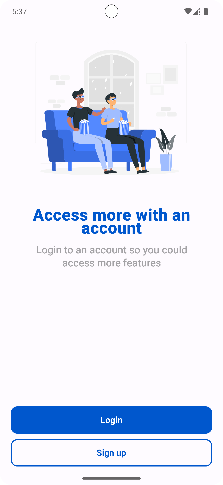
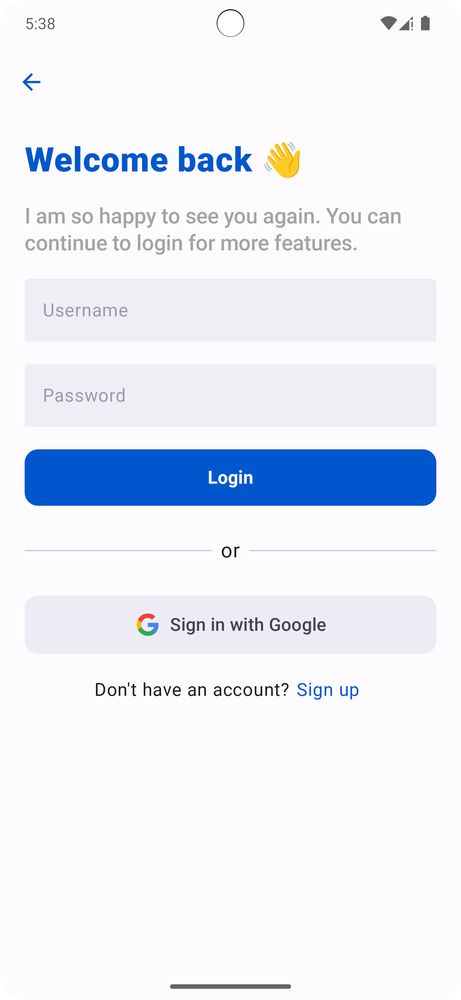
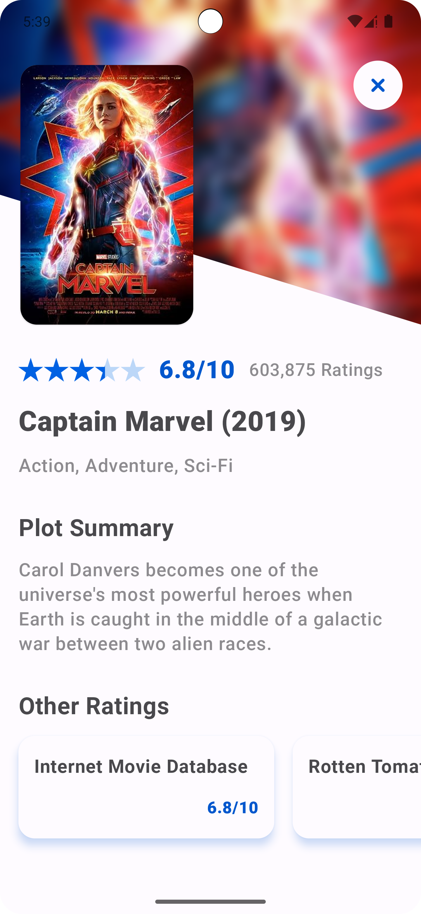
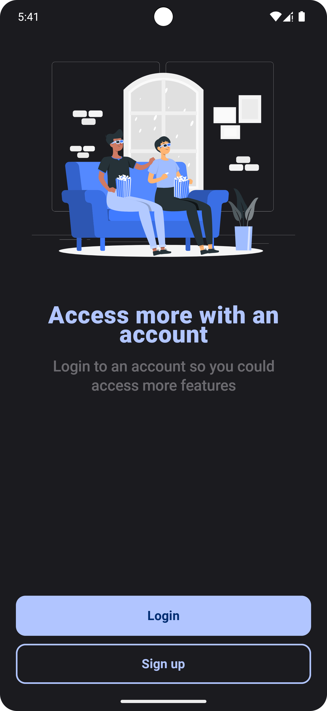
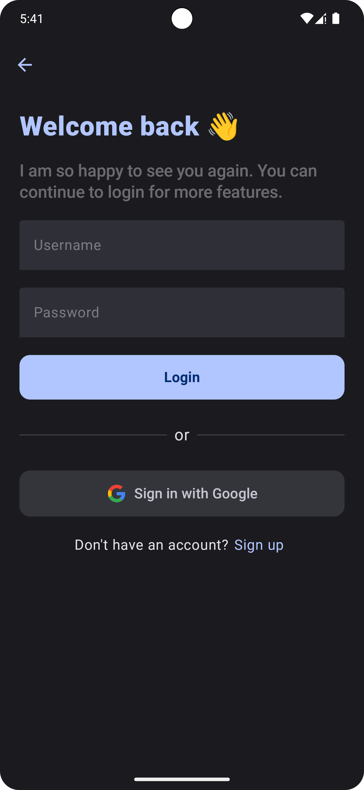
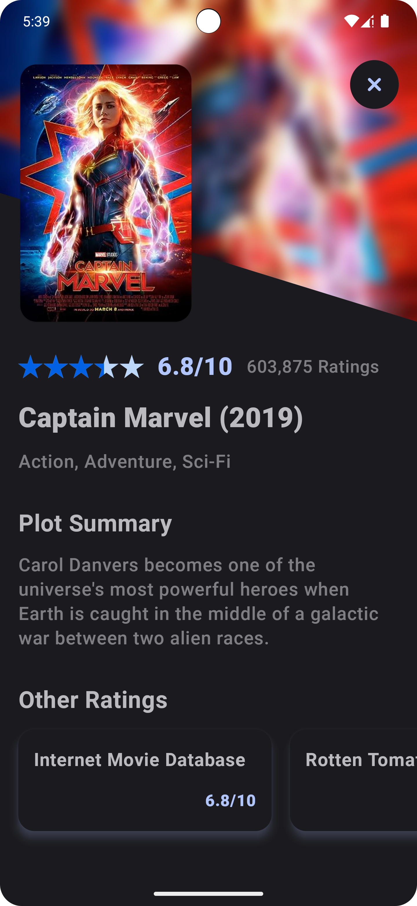

# Movies

The Movies App is a Android application designed to provide users with information about Marvel movies. 

## Requirements

- Android Studio Iguana version 2023.2.1 or higher (Due to usage of AGP version 8.3)

  You can download the latest version of Android Studio from [here](https://developer.android.com/studio).

 ## ScreenShots 📷  

  <h3> Light Version </h3>
   
   
   
   
  
    
  <h3> Dark Version </h3>
   
   
   
   
  

 

## Download Application 👇

- The APK file ([app-debug.apk](app-debug.apk)) can be founded under the root folder

  
